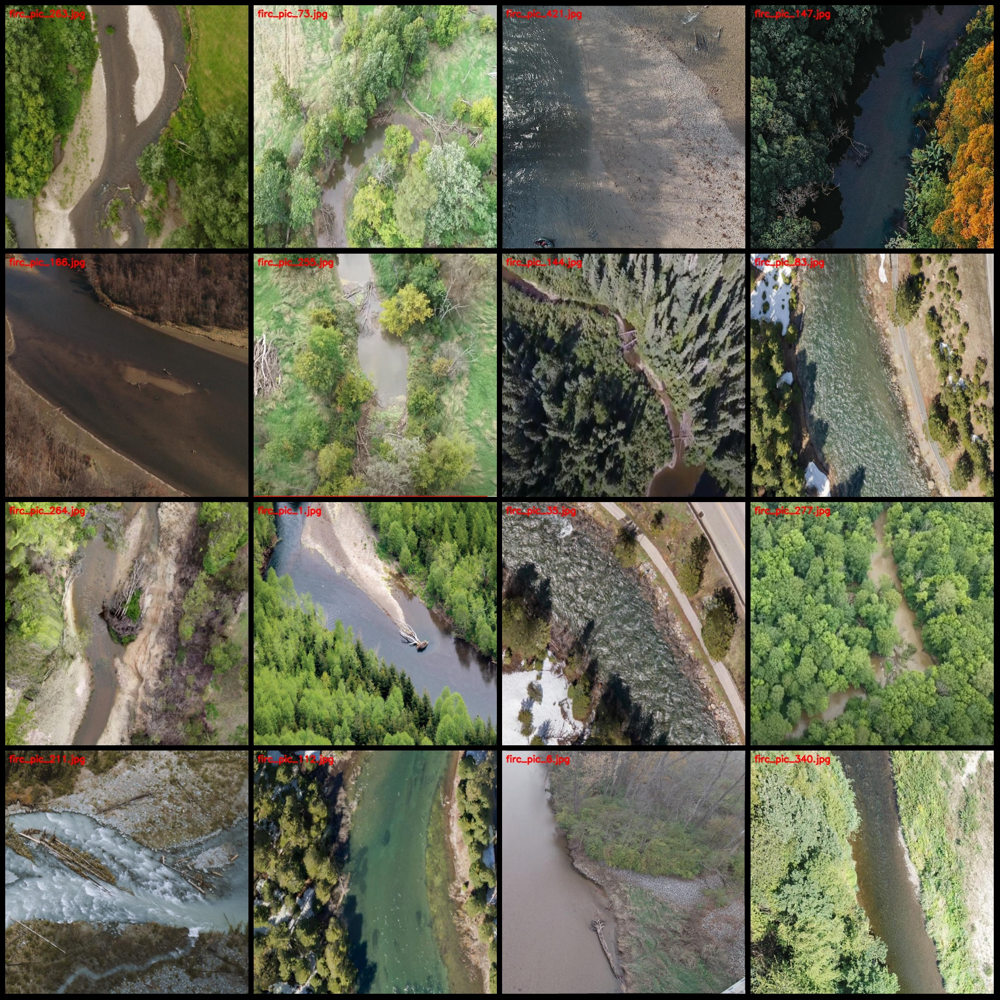
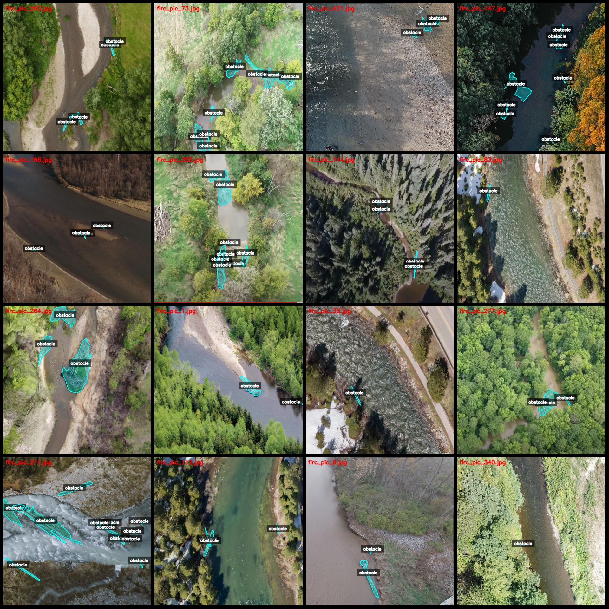
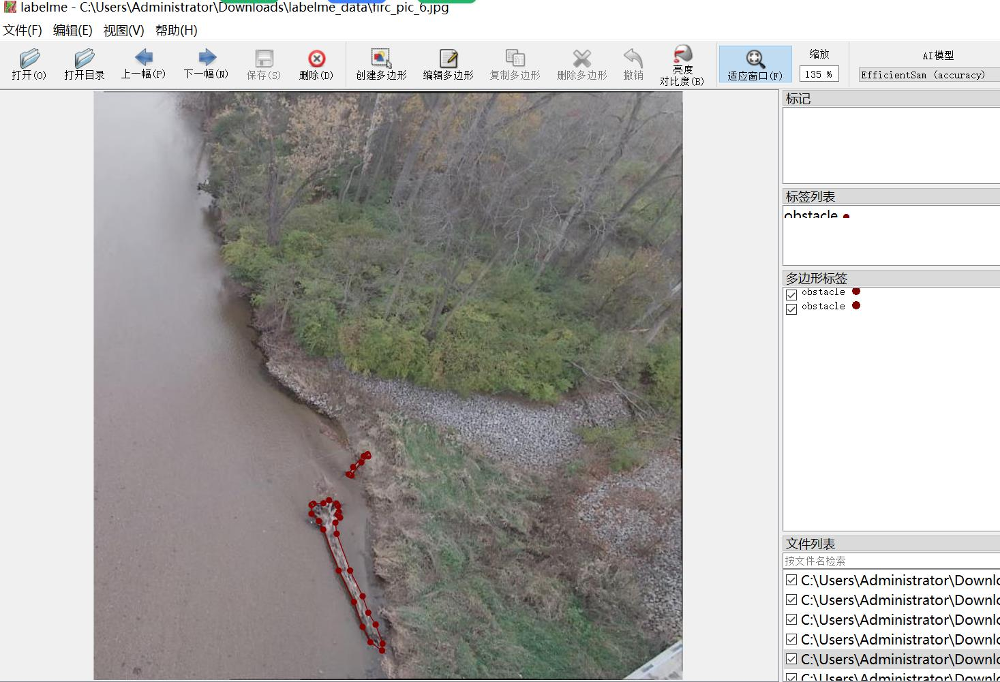

# Unmanned Vision River Obstacles Identification Dataset (LabelMe Format) - 432 Images, 1 Category

The dataset format is LabelMe (excluding the mask file but only including JPG images and their corresponding JSON files).

Number of images (JPG file counts): 432
Number of annotations (JSON file counts): 432
Number of categories: 1
Annotation category name: ["obstacle"]
Number of bounding box counts for each category:
   - obstacle count = 2488
Total number of bounding boxes: 2488

Annotation tool used: labelme = 5.5.0

Image resolution: 640x640
Annotation rules: Polygon is drawn around the category

Important note: You can edit the dataset with labelme and convert the JSON dataset into a mask or Yolo or COCO format for semantic segmentation or instance segmentation.

Special statement: This dataset does not guarantee the accuracy of the trained model or weight files.

Sample image preview:
Annotation example:
Original image (randomly selected 16 images):
Annotation drawing result:
LabelMe editing image example:

## Images

Here is a pay link on Stripe ( https://buy.stripe.com/3cs8yP7sY87d0vu9AB ). Please contact me lonlonago@foxmail.com after funding $89, and I will send you a complete data files , thank you!

